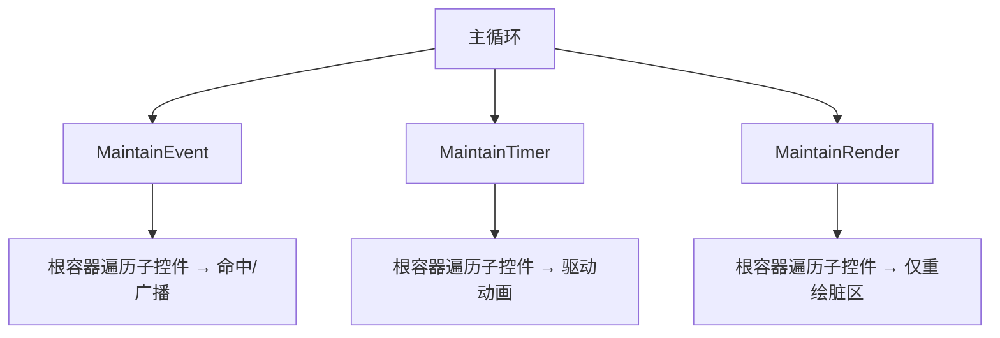

# 02 - 核心架构

理解 Fgui 的架构只需要抓住三件事：**所有控件继承自一个基类**、**每个控件有"渲染 / 事件 / 定时器"三个回调**、**脏区重绘驱动渲染**。

## 1. 控件体系

```
                 Fgui_Control  (抽象基类)
                    │
        ┌───────────┼───────────┬─────────── ...
        │           │           │
   ControlBox   ScrollBarV   ScrollBarH
        │（容器：持有子控件）
        │
   PushButton / StaticText / LinkText / InputBox /
   CheckBox / ToggleButton / RadioButton / PictureBox /
   Slider / ComboBox / ProgressBar / TabControl / QRCodeBox
```

### `Fgui_Control` 基类

所有控件直接或间接继承 `Fgui_Control`。它定义了：

```cpp
class Fgui_Control {
protected:
    Fgui_ColorKit color_kit;        // 配色
    uint64_t timer_time = 0;        // ActionOnTimer 调用间隔（0=每帧）
    SDL_Rect  dirty_region;         // 脏区
    bool      visibility = true;    // 可见性
public:
    ControlBox* parent = nullptr;   // 父容器
    SDL_Rect    default_rect = {0,0,0,0};   // 控件矩形（相对父容器）

    // --- 三个必须实现的纯虚回调 ---
    virtual void ActionOnPaint(SDL_Renderer*, const SDL_Rect& dirty, const SDL_Rect& relative_rect) = 0;
    virtual void ActionOnEvent(const SDL_Event*, const SDL_Rect& relative_rect) = 0;
    virtual void ActionOnTimer(const SDL_Rect& relative_rect) = 0;
    virtual std::string ActionOnGetTypeName() const = 0;

    // --- 公共维护入口（框架调用，不要重载） ---
    SDL_Rect MaintainRender(SDL_Renderer*, const SDL_Rect& relative_rect); // 渲染
    void     MaintainTimer(const SDL_Rect& relative_rect);                 // 定时器
    void     MaintainEvent(const SDL_Event*, const SDL_Rect& relative_rect); // 事件

    // --- 脏区控制 ---
    void InvalidateRect();                       // 标记整个控件重绘
    void InvalidateRect(const SDL_Rect&);        // 标记局部区域重绘
    void ClearInvaildRect();
    SDL_Rect GetInvaildRect(const SDL_Rect&) const;
    SDL_Rect GetRelativeInvaildRect() const;

    // --- 其它 ---
    void SetVisibility(bool); bool IsVisibility() const;
    const Fgui_ColorKit& GetColorKit() const;
};
```

### 三个回调的语义

| 回调 | 何时调用 | 典型用途 |
| --- | --- | --- |
| `ActionOnPaint` | 控件存在脏区且被渲染时 | 绘制控件外观 |
| `ActionOnEvent` | 收到 SDL 事件（被广播/命中时） | 处理鼠标键盘交互 |
| `ActionOnTimer` | 每帧（或每 `timer_time` ms） | 动画、光标闪烁、状态推进 |

> **约定**：三个回调内部都**禁止调用延时函数**（如 `SDL_Delay`），它们被设计成"一帧内快速执行"。

## 2. 三套维护机制

框架（通常是根 `ControlBox`）在每帧调用三套 `Maintain*`，逐层分发：



### 事件分发（MaintainEvent）

- 容器把事件转发给所有子控件，子控件用 `relative_rect` + `default_rect` 做**命中测试**（`isPointInsideRect`）。
- `relative_rect` 表示"父容器的矩形"（不含子控件自身偏移），子控件通过 `RelativizePoint(pt, relative_rect)` 把鼠标坐标转为相对坐标，再用 `isPointInsideRect(pt, default_rect)` 判断是否在自己内部。
- 滚轮事件采用**广播 + 消费标记**机制：`wheel_consumed` 标志位，任一子控件消费后父容器不再滚动自身。

### 定时器维护（MaintainTimer）

- `timer_time == 0` 时每帧调用 `ActionOnTimer`；否则按 `SDL_GetTicks64() / timer_time` 分频。
- 典型用途：`InputBox` 的光标闪烁（500ms）、`PushButton` 的悬停颜色过渡、`ProgressBar` 的处理中动画。

### 渲染维护（MaintainRender）

- 只会在**存在脏区**（`dirty_region.w/h > 0`）时调用 `ActionOnPaint`，并设置裁剪矩形限定绘制范围。
- 绘制完成后自动清空脏区。
- 脏区是**自下而上**累积、**自上而下**绘制：
  1. 子控件调用 `InvalidateRect` 标记自己脏。
  2. 容器在 `ActionOnTimer` 里 `TestInvalidateRect` 汇总子控件脏区到自己。
  3. 根容器渲染时把脏区裁剪后下发给每个子控件绘制。

## 3. 脏区重绘（核心优化）

传统 SDL 程序每帧重画全部内容；Fgui 只重绘"发生变化"的区域：

```cpp
void InvalidateRect(const SDL_Rect& rect){ dirty_region = ExtendRect(dirty_region, rect); }
```

- 控件修改自身状态时调用 `InvalidateRect()` 即可"请求重绘"。
- `MaintainRender` 检查脏区：没有脏区就直接返回，**不调用** `ActionOnPaint`，省去纹理创建等开销。
- 容器 `ControlBox::ActionOnPaint` 会对每个子控件计算"脏区 ∩ 子控件矩形 ∩ 视口"的交集，只绘制真正可见且变脏的部分，并通过 `SDL_RenderSetClipRect` 裁剪。

> 为什么还"不够快"？因为 SDL2 每次 `SDL_RenderPresent` 仍要交换整个缓冲区，脏区重绘主要省掉了"纹理创建 / 整幅绘制"的 CPU 开销。这在复杂场景下依然有明显的性能收益。

## 4. 坐标约定（重要）

- `default_rect`：控件相对父容器的矩形（含位置与尺寸）。
- 绘制回调传入的 `relative_rect` = 控件的**屏幕绝对位置**（父原点 + 滚动偏移）。
- 事件回调传入的 `relative_rect` = 父容器原点 **减去滚动偏移**（**不含** 子控件 `default_rect.xy`）。

> ⚠️ 因此：
> - **绘制**：`draw_area = {relative_rect.x, relative_rect.y, ...}`（直接用）。
> - **事件**：屏幕矩形需自行加上偏移：`draw_area = {relative_rect.x + default_rect.x, relative_rect.y + default_rect.y, ...}`。
>
> 这是 Fgui 最容易踩的坑，详见 [常见问题与陷阱](10-常见问题与陷阱.md)。

## 5. 全局开关

```cpp
void Fgui_ConfigControlAnimation(bool enable);   // 全局控件动画开关
extern bool enable_animation;                    // 全局状态
```

开启动画（`enable_animation == true`）后，`PushButton` 悬停/按下颜色会平滑过渡、`ControlBox` 滚动会平滑、`CheckBox`/`ToggleButton`/`RadioButton`/`Slider`/`ProgressBar` 的数值与状态变化会有动画。代价是更多定时器重绘。

## 下一步

- 了解容器与布局：[ControlBox 与布局](03-ControlBox与布局.md)
- 看全部控件 API：[控件参考](04-控件参考上-基础控件.md)
